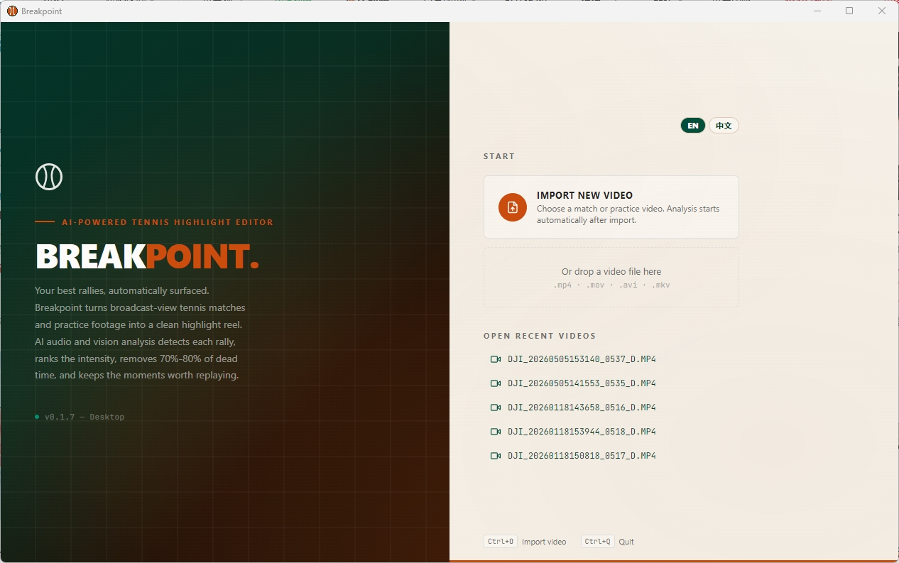
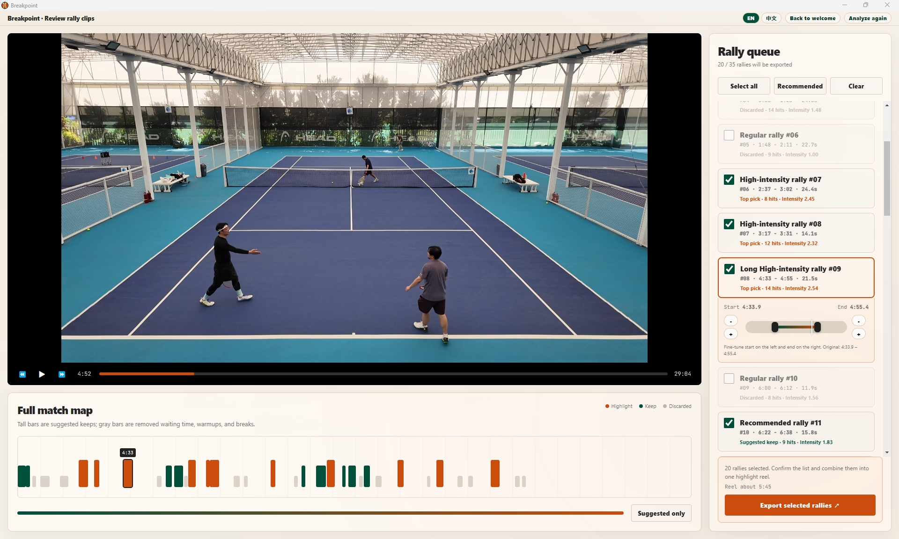

# Breakpoint

Automatically extract highlight rallies from broadcast-angle tennis match footage.

Breakpoint analyzes full-length tennis videos using audio-based hit detection and computer vision to identify, rank, and export the best rallies — no manual scrubbing required.

**Website:** [xinyiz1226.github.io/Breakpoint](https://xinyiz1226.github.io/Breakpoint/)



## Features

- **Hit Detection** — Detects ball strikes via audio onset analysis with adaptive thresholds
- **Smart Segmentation** — Splits the match into individual rallies using silence gaps, with density trimming and duration filtering
- **Vision Ranking** — Scores each rally by player motion intensity (large court coverage, diving saves, etc.)
- **Player Identity** — Uses the free Apache-2.0 YOLOX-Nano model and appearance matching to keep stable anonymous player IDs across court-side changes
- **Rally Queue & Match Map** — Browse rallies ranked by intensity in a queue view; visualize rally distribution across the full match in a match map
- **One-Click Export** — Export selected highlights as a single compiled video via ffmpeg

## Desktop App

Breakpoint ships as a standalone Windows desktop application. No Python, ffmpeg, or other dependencies required — everything is bundled in the installer.

### Download

Grab the latest release from the [Releases](https://github.com/xinyiz1226/Breakpoint/releases) page:

- **Breakpoint x.x.x.msi** — MSI installer

### Usage

1. **Open a video** — Launch the app and click "Open Video" or select a recent project
2. **Analyze** — The pipeline runs automatically: audio extraction → hit detection → segmentation → vision ranking. This produces a timeline (`full_report.json`) of ranked rally segments — no video files are generated at this stage.
3. **Review** — Browse rallies in the Rally Queue (sorted by intensity score) and the Match Map (full-match overview). The system auto-recommends rallies in three tiers: highlight, keep, and cut.
4. **Edit** — Click any rally to preview; adjust start/end times and toggle inclusion. Confirm your selection before export.
5. **Export** — Click "Export" to compile the selected rallies into a single highlight `.mp4` video



## Tech Stack

| Layer | Technology |
|-------|-----------|
| Analysis engine | Python 3.14, librosa, OpenCV, YOLOX-Nano, NumPy, SciPy |
| Desktop app | Electron, React, TypeScript, Vite |
| Video processing | ffmpeg |
| Packaging | PyInstaller (engine), electron-builder (installer) |

## Project Structure

```
engine/          Analysis pipeline (audio, vision, segmentation, ranking, export)
├── audio/       Audio extraction and hit detection (librosa)
├── vision/      Player motion analysis (OpenCV)
├── export/      Clip extraction and highlight compilation (ffmpeg)
├── pipeline.py  Main orchestrator
├── segmentation.py
├── ranking.py
└── ffutil.py

desktop/         Electron + React desktop application
├── src/main/    Electron main process (Python bridge, ffmpeg export)
├── src/renderer/ React UI (video player, rally queue, match map)
└── scripts/     Build and packaging scripts

tools/           Development utilities (comparison, parameter sweep, tests)
web/             Legacy Flask web UI
```

Vision-enabled reports include a `players` object for each rally. `player_1` and
`player_2` are anonymous appearance-based identities; each records the player's
current court side, detection/identity confidence, normalized movement distance,
sample count, and mean frame position. Actual player names are not inferred.

The bundled `engine/vision/models/yolox_nano.onnx` model is distributed under
Apache License 2.0. Its source and checksum are documented in
`engine/vision/models/MODEL_INFO.txt`.

## Open Source License and Commercial Licensing (License)

This project is released under the **GNU Affero General Public License v3 (AGPL-3.0)**.

- **Personal / coach / research use**: free of charge. You may freely deploy, modify, and use this project for personal match review or teaching.
- **Cloud service and commercial use (anti-free-riding clause)**: if you plan to integrate this project's core algorithms (including but not limited to tennis target detection, rally segmentation, and automatic highlight editing logic) into your **commercial SaaS, WeChat mini-program, commercial app, or paid website backend services**, then under AGPL-3.0, **you must open-source the complete source code of your entire commercial system without additional restrictions**.
- **Commercial License**: if you do not want to open-source your system code but would like to use Breakpoint technology in commercial products, please contact the author for a commercial license.
